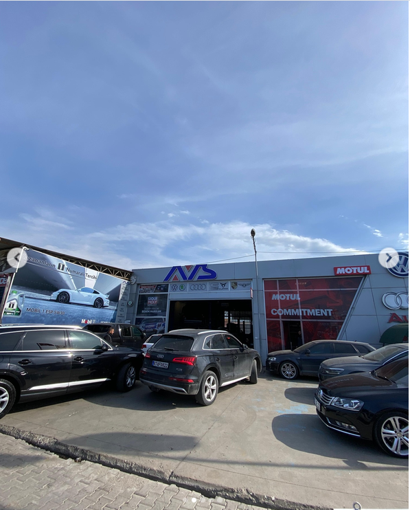

# AVS Service & Repair — Website

**Multi-branch corporate website for AVS Service & Repair, a car service with branches in Bartın and Çaycuma (Zonguldak).**


**Website:** https://avsservis.com (domain configured in `src/config/business.ts`)

> Client project — designed and developed by Berke Coşkuner for **AVS Service & Repair**.



---

## Overview

A Turkish-language, SEO-focused website for AVS Service & Repair, an automotive maintenance and repair business with a main branch in Bartın Merkez and a second branch in Çaycuma, Zonguldak. The site presents services for Volkswagen, Audi, Seat, Skoda and Porsche vehicles, shows both branches with maps and opening hours, and lets customers send a service request to the branch they choose.

## Features

- **Home page** sections: Hero slider, TrustBar, ServicesGrid, WhyAVS, BrandExpertise, ProcessSteps, AboutPreview, GalleryPreview, ContactCTA
- **Branches page** (`/subelerimiz`) and contact page listing both branches with address, phone, WhatsApp, opening hours and an embedded Google Map
- **12 service pages** statically generated from one data file (`/hizmetler/[slug]`): periodic maintenance, fault diagnosis, engine & mechanical repair, DSG & gearbox, brakes & suspension, auto electrics, A/C, DPF & EGR, turbo, oil & filter, battery & charging, general inspection — each with checklists, symptoms and FAQs
- **Gallery** (`/galeri`) with category filter and keyboard-friendly lightbox (Esc / arrow keys)
- **Contact form** posting to `/api/contact`: branch selection, server-side validation, honeypot spam protection, KVKK consent check, email via Nodemailer/SMTP; logs to the server console when SMTP is not configured
- **Local SEO**: JSON-LD `AutoRepair` / `Service` schemas, dynamic `sitemap.xml` and `robots.txt`
- **Legal pages**: KVKK, privacy policy, cookie policy, cookie banner
- **Mobile UX & accessibility**: sticky header, mobile menu, bottom action bar, WhatsApp button, keyboard navigation, `prefers-reduced-motion` support
- **Central configuration**: all business data (branches, phones, hours, social links, SEO) in `src/config/business.ts`

## Tech stack

| Layer | Tools |
| --- | --- |
| Framework | Next.js 16 (App Router, SSG), React 19 |
| Language | TypeScript 5 |
| Styling | Tailwind CSS 4, lucide-react icons |
| Email | Nodemailer (SMTP) |
| Deployment | Multi-stage Dockerfile (`output: "standalone"`), Vercel-compatible, PM2 + Nginx |

## Project structure

```text
src/
├── app/                  # /, /hakkimizda, /hizmetler, /hizmetler/[slug], /galeri,
│   │                     # /subelerimiz, /iletisim, /kvkk, /gizlilik-politikasi, /cerez-politikasi
│   ├── api/contact/      # Contact form API route (Nodemailer)
│   ├── robots.ts
│   └── sitemap.ts
├── components/
│   ├── home/             # Home page sections
│   ├── layout/           # TopBar, Header, MobileMenu, Footer
│   ├── contact/          # ContactForm
│   └── ui/               # Breadcrumbs, CookieBanner, JsonLd, WhatsAppButton, ...
├── config/business.ts    # Business info, branches, SEO settings
├── data/                 # services.ts, gallery.ts
└── types/
public/images/            # Workshop photos and service images
```

## Getting started

Requirements: Node.js 18+ and npm 9+.

```bash
npm install
npm run dev      # http://localhost:3000
npm run lint
npm run build
npm run start
```

### Environment variables

Create `.env.local` (values are not part of the repo):

| Name | Purpose |
| --- | --- |
| `NEXT_PUBLIC_SITE_URL` | Public site URL (falls back to the domain in `business.ts`) |
| `CONTACT_EMAIL` | Address that receives form submissions |
| `SMTP_HOST`, `SMTP_PORT`, `SMTP_USER`, `SMTP_PASS` | SMTP server credentials (server-side only — never prefix with `NEXT_PUBLIC_`) |

### Updating content

- Business details and branches → `src/config/business.ts` (Header, Footer, contact/branch pages, WhatsApp links and JSON-LD update automatically)
- Services, checklists, FAQs → `src/data/services.ts` (a new entry creates `/hizmetler/<slug>` at build time)
- Gallery → `src/data/gallery.ts` + images in `public/images/`

## Deployment

- **Vercel:** import the repository, add the environment variables above (set `NEXT_PUBLIC_SITE_URL`), deploy.
- **Docker:** `docker build -t avs-service-web .` then `docker run -d -p 3000:3000 --env-file .env avs-service-web`
- **Ubuntu VPS:** `npm install && npm run build`, start with `pm2 start npm --name "avs-web" -- start`, and put Nginx in front as a reverse proxy to `localhost:3000`.

---

## Türkçe

**AVS Service & Repair için çok şubeli kurumsal web sitesi — Bartın ve Çaycuma (Zonguldak) şubeleri.**

> Müşteri projesi — **AVS Service & Repair** için Berke Coşkuner tarafından tasarlandı ve geliştirildi.

### Genel bakış

Bartın Merkez ve Zonguldak Çaycuma şubeleri bulunan AVS Service & Repair otomotiv bakım ve onarım servisi için hazırlanmış, SEO uyumlu Türkçe web sitesi. Volkswagen, Audi, Seat, Skoda ve Porsche araçlara yönelik hizmetleri tanıtır, iki şubeyi harita ve çalışma saatleriyle gösterir ve müşterilerin seçtikleri şubeye servis talebi göndermesini sağlar.

### Özellikler

- Hero slider, güven çubuğu, hizmetler, neden AVS, marka uzmanlığı, süreç adımları ve galeri önizlemesinden oluşan ana sayfa
- **Şubelerimiz** sayfası: adres, telefon, WhatsApp, çalışma saatleri ve Google Haritalar
- Statik üretilen **12 hizmet sayfası** (kontrol listeleri, belirtiler ve SSS ile)
- Kategori filtreli, klavye destekli lightbox **galeri**
- Şube seçimli **iletişim formu**: sunucu taraflı doğrulama, honeypot spam koruması, KVKK onayı, Nodemailer ile SMTP gönderimi
- JSON-LD `AutoRepair` / `Service` şemaları, dinamik sitemap ve robots
- KVKK, gizlilik ve çerez politikası sayfaları
- Tüm firma ve şube bilgileri tek dosyada: `src/config/business.ts`

### Teknolojiler

Next.js 16 (App Router), React 19, TypeScript, Tailwind CSS 4, Nodemailer, Docker.

### Kurulum

```bash
npm install
npm run dev      # http://localhost:3000
npm run build && npm run start
```

Ortam değişkenleri (`.env.local`): `NEXT_PUBLIC_SITE_URL`, `CONTACT_EMAIL`, `SMTP_HOST`, `SMTP_PORT`, `SMTP_USER`, `SMTP_PASS`. SMTP bilgileri yoksa form talepleri sunucu konsoluna yazılır.

### İçerik güncelleme

- Firma ve şube bilgileri → `src/config/business.ts`
- Hizmetler ve SSS → `src/data/services.ts`
- Galeri → `src/data/gallery.ts` ve `public/images/`

### Yayınlama

Vercel'e doğrudan import edilebilir; çok aşamalı `Dockerfile` ile Docker'da ya da Ubuntu VPS üzerinde PM2 + Nginx ile çalıştırılabilir.

---

Built by [Berke Coşkuner](https://github.com/CoskunerBerke)
